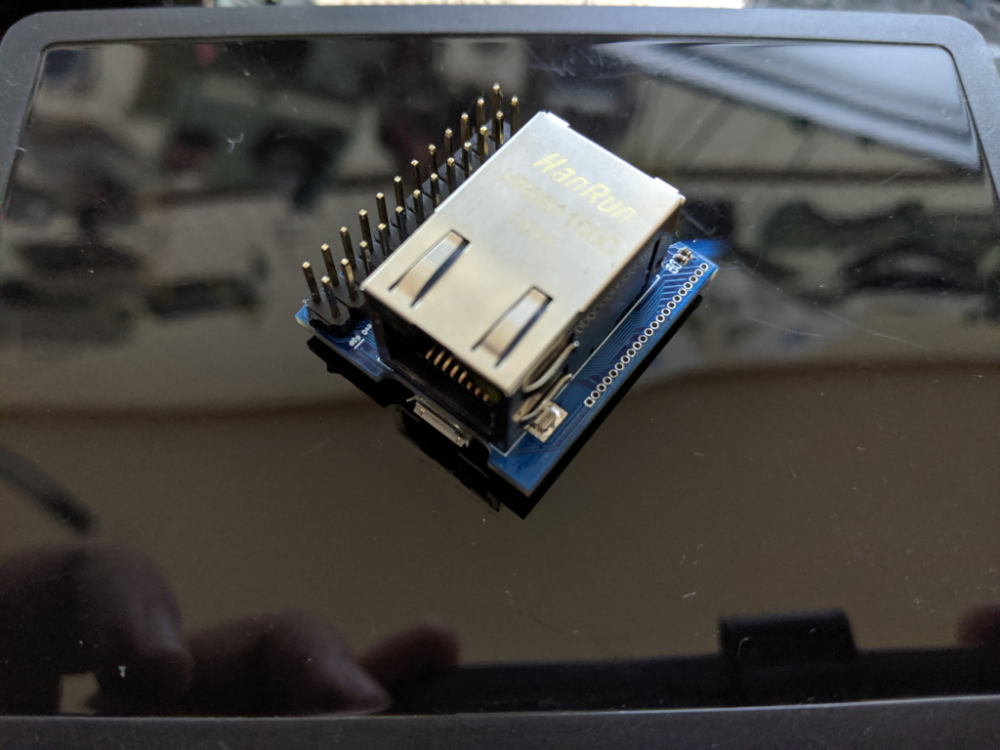
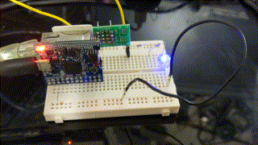

# Breadbee

A very small, 32mm x 30mm, ARM Cortex A7 development board that costs about ~$10
to make in low quantities and can be assembled at home with a cheap hot air rework
station. With a [small adapter socket](./hivee) it can be mounted vertically in a standard breadboard.

The breadbee is based on a relatively unknown IP camera SoC, the MSC313E, from a company called MStar.
You might have never heard of MStar but you probably have one of their chips in your TV.

## Features

These are features that are working:

- ~1GHz Cortex A7 CPU with NEON etc[0].
- 64MB DDR2
- 64KB (maybe more) SRAM 
- [Bootable, memory mapped SPI-NOR](https://github.com/fifteenhex/linux/blob/msc313e/drivers/spi/spi-msc313-isp.c)
- 100Mbit ethernet.
- [4 x 10bit ADC channels](https://github.com/fifteenhex/linux/blob/msc313e/drivers/iio/adc/msc313e_sar.c)
- [2 x SPI](https://github.com/fifteenhex/linux/blob/msc313e/drivers/spi/spi-msc313.c)
- [1 x I2C (there is possibly one more)](https://github.com/fifteenhex/linux/blob/msc313e/drivers/i2c/busses/i2c-msc313e.c)
- [3 UARTs](https://github.com/fifteenhex/linux/blob/b3c521f8f30c9cc6f9f9c5c87429336d4756dcca/drivers/tty/serial/8250/8250_dw.c#L751) [1]
- Lots of GPIO. At least one pin with wake up support.
- [RTC](https://github.com/fifteenhex/linux/blob/msc313e/drivers/rtc/rtc-msc313e.c)
- [WDT](https://github.com/fifteenhex/linux/blob/msc313e/drivers/watchdog/msc313e_wdt.c)
- [3 x Timer](https://github.com/fifteenhex/linux/blob/msc313e/drivers/clocksource/timer-msc313e.c)
- [8 x PWM](https://github.com/fifteenhex/linux/blob/msc313e/drivers/pwm/pwm-msc313e.c)
- [SD/SDIO interface](https://github.com/fifteenhex/linux/blob/msc313e/drivers/mmc/host/mstar-fcie.c)

[0] MStar says it's 800MHz but their own cpufreq code says they clock it to 1GHz
Clocking up to 1.1GHz works fine running dhrystone for hours but causes random lock ups if the spi nor controller and ethernet are fighting for bus access.
[1] One UART is used by the serial console, two more are available via muxing. 

 The chip has a bunch of stuff in it that isn't supported yet:
 - USB
 - Camera interface, h264 encoder, mjpeg etc.
 - Audio ADC/DAC
 - [Crypto engine](https://github.com/fifteenhex/linux/blob/msc313e/drivers/crypto/msc313-aesdma.c) that seems to be able to do AES encrypted DMA transfers, memory mapped AES encryption etc
 - 8051 low power mode management MCU
 - Some sort of IR decoder that can wake the chip up based on the IR codes it sees.
 - 6 byte unique device ID and efuse for key storage
 - [block dma controller](https://github.com/fifteenhex/linux/blob/msc313e/drivers/dma/mstar/mstar-msc313-bdma.c)
 - [command queue dma controller](https://github.com/fifteenhex/linux/blob/msc313e/drivers/dma/mstar/mstar-msc313-cmdq.c)
 - On die temperature sensor.

It's full of flashy magic!

## Motivations

- Networked microcontrollers are a disaster waiting to happen; Many solutions - even commercial ones - use LWIP as the TCP/IP stack with no intention of actually maintaining it, use relatively unknown TLS libraries because of lack of memory, have no memory protection, no isolation between the moving parts.

- There are no solutions yet that can run a real OS like Linux that can be integrated by hobbyists into boards from cheap PCB vendors that don't have show stopping limitations. I.e. the AllWinner V3s is very similar to the SoC used here but it only has one SPI controller that is lost as soon as you put SPI NOR on it. The MSC313E has just enough of the usual microcontroller peripherals to make it useful, comes in a (relatively) easy to work with QFN package, is tiny and costs ~$4.
It is a bit harder to integrate into your designs than a microcontroller that requires a single power supply but all of the information you would need to do so is right here. The schematic for the breadbee is incredibly simple.

- There are single board computers out there that have more cores, more memory etc and are still around $10 but they are over kill for applications where even an ESP32 has enough horse power and they aren't usually something you can integrate into your project without reserving considerable space.

- Why not? The MSC313E is a Cortex-A so getting Linux running from scratch was relatively simple. The peripherals are super weird in places but not totally insane.

## But where's the WiFi!>!!111

The breadbee is meant to be a "minimum viable product" to get the ball rolling. It's impossible to write drivers for the SDIO controller or USB needed for WiFi without a platform to work on. Breadbee is that platform. Once SDIO works there will be an Ampak AP6212 based module to add wifi to breadbees and maybe a respin of the breadbee with the ethernet jack replaced with an Ampak module. 

## Can I have one.. where do I get the chips..

- If you ask very nicely and you are willing to do something like write a nice python library or flesh out drivers for the board it's possible you can have one of the prototype boards for FREE! Get in touch!

- If you just want to buy one the intention is to put the board up on a crowd sourcing site at some point. When that happens that information will be here.

- If you want chips to integrate into your own projects and don't have contacts in Shenzhen to get them get in touch and we'll figure something out. If you want 2080 of them getting them isn't a problem. If you want one or two I have a small supply. If the crowd sourcing happens and there is enough money left to buy extra chips to distribute in more accessible ways I will.

## Software

Note that this is all in flux right at the moment. These repos are getting rebase'd fairly often.

### U-boot

There is a basic port of u-boot that so far take over from the MStar IPL and load a kernel from the SPI NOR, write it etc.
See boot process below for more details.

https://github.com/fifteenhex/u-boot/tree/msc313

### Kernel

All of the above features work to some degree.

https://github.com/fifteenhex/linux/tree/msc313e

### Buildroot

Combines the u-boot and kernel above with a root filesystem and generates flashable images.
There are some small peices of a board configuration application called "beecfg" to setup pinmuxing etc.

https://github.com/fifteenhex/breadbee_buildroot

## Pin Table

### J2 - Main 2.54mm header

| interrupt | 5v tolerant |   notes   | alt functions           |    name   |  # |  # |   name    | alt functions |   notes   | 5v tolerant | interrupt |
|-----------|-------------|-----------|-------------------------|-----------|----|----|-----------|---------------|-----------|-------------|-----------|
|           |             |           |                         |    +5v    |  1 | 2  |   +3v3    |               |           |             |           |
|           |             |           |                         |    gnd    |  3 | 4  | pm_gpio4  |               | [0]       |    yes      |   yes     |
|           |             |           |                         | i2c1_scl  |  5 | 6  | i2c1_sda  |               |           |             |           |
|   yes     |             |           | ej_tck, pwm4            | spi0_cz   |  7 | 8  | spi0_ck   | ej_tms, pwm5  |           |             |   yes     |
|   yes     |             |           | ej_tdo, pwm6            | spi0_di   |  9 | 10 | spi0_do   | ej_tdi, pwm7  |           |             |   yes     |
|           |     yes     |           |                         | sar_gpio2 | 11 | 12 | sar_gpio3 |               |           |    yes      |           |
|           |     yes     |           |                         | sar_gpio1 | 13 | 14 | sar_gpio0 |               |           |    yes      |           |
|           |     yes     |   cs      | spi0_cz, pwm0           | fuart_rx  | 15 | 16 | fuart_tx  | spi0_ck, pwm1 |   clk     |    yes      |           |
|           |     yes     | mosi, [1] | spi0_di, pwm2, uart1_rx | fuart_cts | 17 | 18 | fuart_rts | spi0_do, pwm3, uart1_tx |   miso    |    yes      |           |
|           |             |           |                         | sr_io7    | 19 | 20 | sr_io6    |               |           |             |           |
|           |             |           |                         | sr_io5    | 21 | 22 | sr_io4    |               |           |             |           |
|           |             |           |                         | sr_io3    | 23 | 24 | sr_io2    |               |           |             |           |

0 - might be input only.
1 - When fuart is mux'd in it's also possible to mux'in uart1 and get a working rx only
    second uart here.

### J4 - Misc/High speed interfaces

| name      | #  | alt functions | 5v tolerant | interrupt | notes |
|-----------|----|---------------|-------------|-----------|-------|
| +3v3      | 1  |               |             |           |       |
| sd_d3     | 2  |   spi1_do     | yes         |           | miso  |
| sd_d2     | 3  |   spi1_di     | yes         |           | mosi  |
| sd_d1     | 4  |   spi1_ck     | yes         |           | clk   |
| sd_d0     | 5  |   spi1_cz     | yes         |           | cs    |
| sd_cmd    | 6  |               | yes         |           |       |
| sd_clk    | 7  |               | yes         |           |       |
| pm_sd_cdz | 8  |               |             | yes       |       |
| gnd       | 9  |               |             |           |       |
| +5v       | 10 |               |             |           |       |
| usb_dm    | 11 |               |             |           |       |
| usb_dp    | 12 |               |             |           |       |
| gnd       | 13 |               |             |           |       |
| sr_io15   | 14 |               |             |           |       |
| sr_io14   | 15 |               |             |           |       |
| sr_io13   | 16 |               |             |           |       |
| sr_io12   | 17 |               |             |           |       |
| sr_io11   | 18 |               |             |           |       |
| sr_io10   | 19 |               |             |           |       |
| sr_io9    | 20 |               |             |           |       |
| sr_io8    | 21 |               |             |           |       |

### Test Points

- The audio pins are broken out to a series of test points on the left side of the parts size of the board.
- pm_irin is broken out to a test point on the ethernet jack side of the board.

## Using JTAG

JTAG is enabled at boot up on the spi0 pins by the u-boot SPL.

## Boot process

The standard MStar boot process is like this:
- Start the boot rom that is baked into the chip
- Load the "IPL" from SPI NOR into internal SRAM
- Jump into the IPL
- The IPL then does DRAM setup and tries to load "IPL_CUST" from SPI NOR or somewhere else if that fails
- IPL_CUST does a bunch of higher level stuff and then loads an XZ compressed u-boot image into DRAM and starts it

The ideal boot process would be:

- Start the boot rom that is baked into the chip
- Load the u-boot SPL
- u-boot SPL does DRAM setup and loads the main u-boot from SPI NOR into DRAM and starts it.

Unfortunately the DRAM setup process isn't understood yet. So the actual boot process is:

- Start the boot rom that is baked into the chip
- Load the IPL
- Trick the IPL into loading the u-boot SPL as IPL_CUST into DRAM (IPL_CUST is limited to 64K so we still need the SPL)
- SPL loads the main u-boot and starts it.
