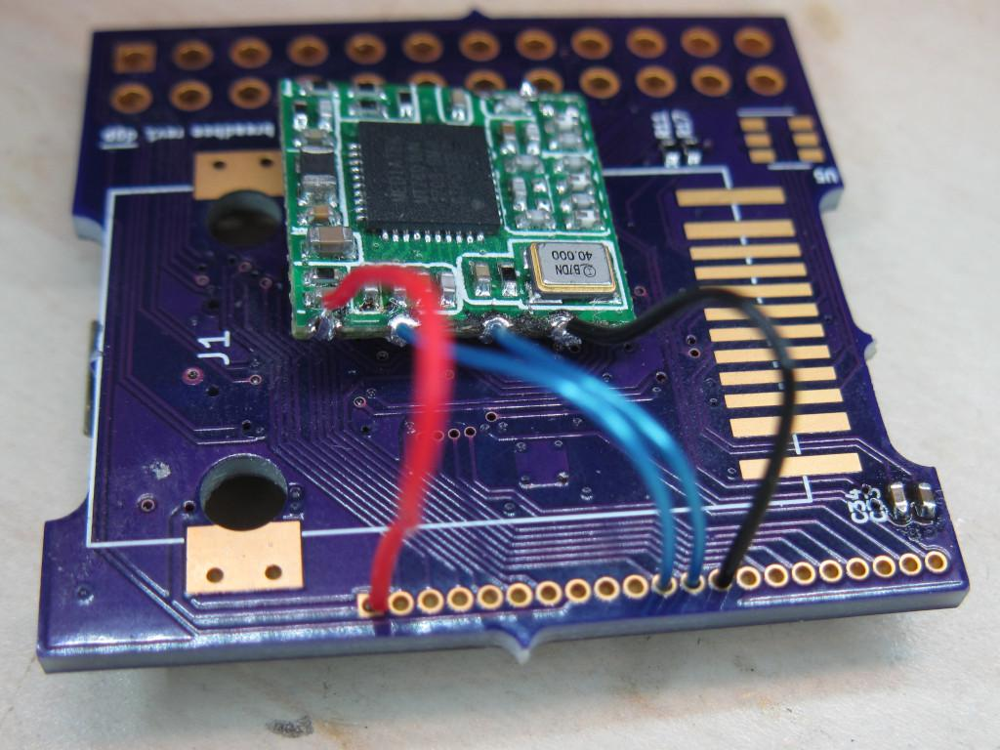
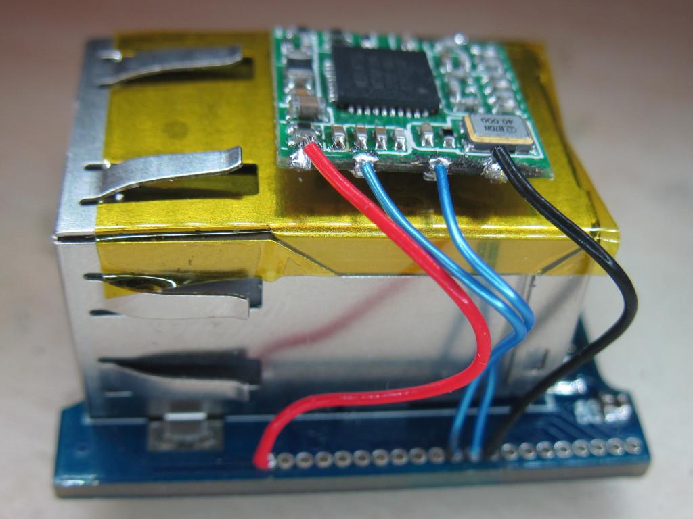
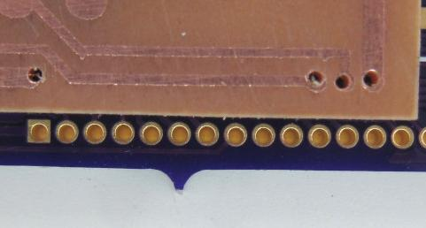
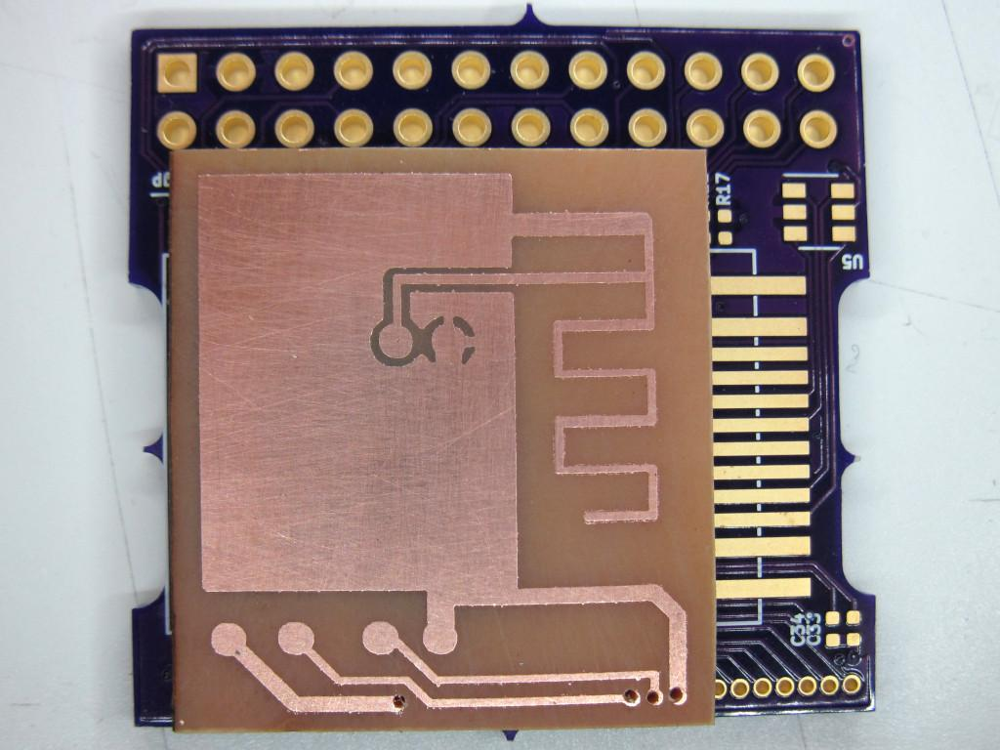
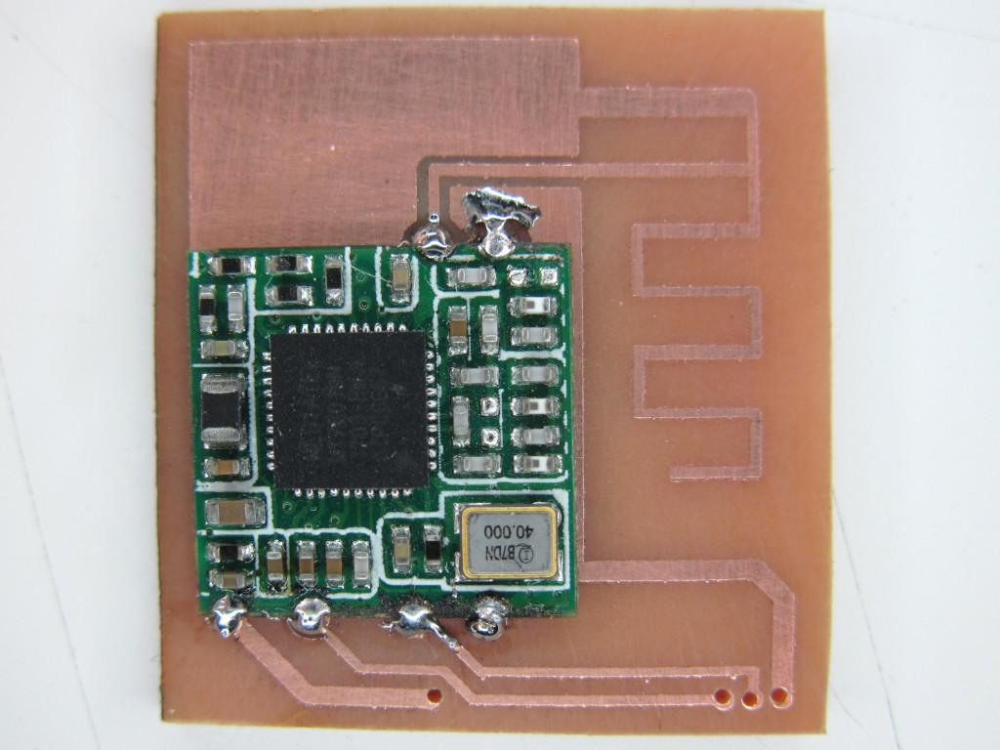
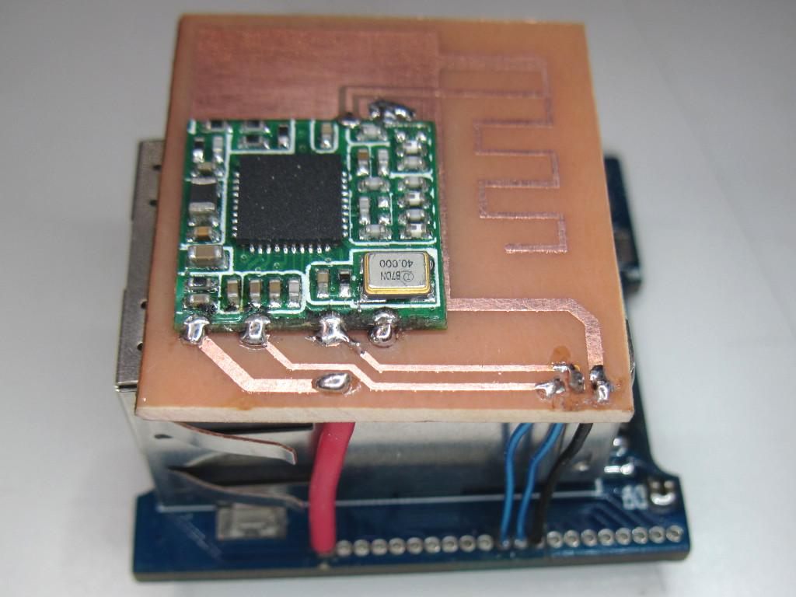
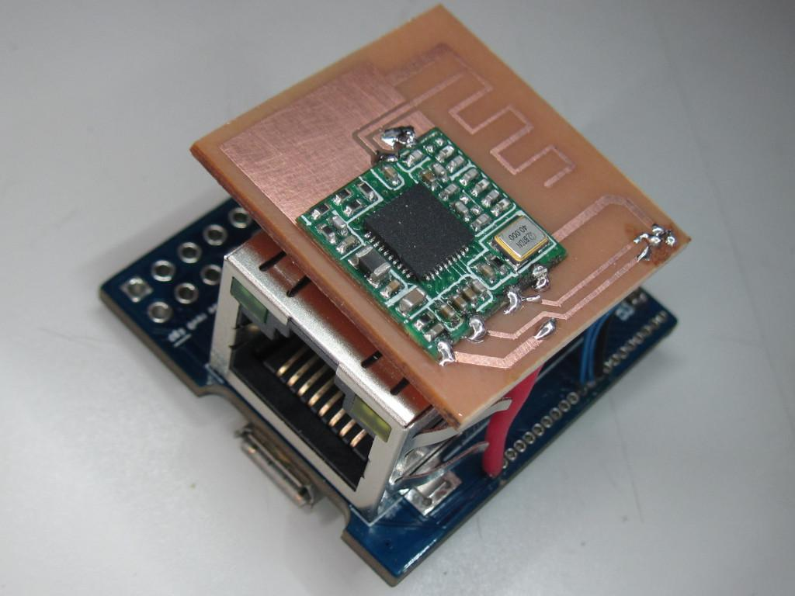

# How to simply add WiFi to a breadbee

This is far from being of high quality, but provided little effort, it is possible to add a simple WiFi module to the breadbee.

There are a wide variety of cheap USB modules provided as a small 12.3x13mm PCB with 4 pins on one side and 2 on the other one. These modules work from 3.3V and are connecte via USB. Usually they do not have any antenna but one can be connected to the two pins on one side.

Such modules are widely used in WiFi cameras and various consumer appliances, and are usually available from $1.50 to $5.00 depending on the modules. Just search for RTL8188EUS, RTL8188ETV, RTL8188FTV, MT7601U to find a few such devices. Most of them use the exact same footprint and pinout.

The breadbee board features a USB 2.0 controller with a port accessible on the J4 connector:

Pin |  Function
----|-----------
  1 |   +3.3V
 11 |   USB-DM
 12 |   USB-DP
 13 |   GND

Modules which contain a connector can be directly connected to these pins using 4 wires, as shown below:

  

  

In order to get a cleaner assembly, it is recommended instead to build a breakout board for the module. This is what is proposed in this directory.

The board was designed using Eagle CAD, for which the files are available in the  but the schematic and board layout are also provided as PDF and PNG in the . The board contains a PCB-printed antenna. These antennas can be efficient but are quite complex to design because they depend on the PCB's material and thickness, and the surrounding metal parts. There is a widely available literature on the subject but given the author had no experience there, a first quick-and-dirty attempt was made, losely inspired by the following documents after carefully studying them, and taking into account the constraints of the PCB's size and the fact that the one used here was single-sided:
 - https://www.nxp.com/docs/en/nxp/application-notes/AN11994.pdf
 - http://www.idc-online.com/technical_references/pdfs/electrical_engineering/A%20Highly%20Reliable%20Platform.pdf
 - https://www.cypress.com/documentation/application-notes/an91445-antenna-design-and-rf-layout-guidelines
 - https://www.autodesk.com/products/eagle/blog/everyday-app-note-design-efficient-antenna-rf-layout/
 - https://e2e.ti.com/support/wireless-connectivity/bluetooth/f/538/t/626343?CC2640R2F-Need-Smaller-BLE-2-4G-antenna-TI-design

The board was made using cheap 1.6mm FR4 PCB and provided great results (mesured as the ability to connect and maintain a correct TCP transfer rate at a given distance). Without any antenna, such boards barely connect more than 5-10 meters away on the same floor. With the PCB's antenna, it was possible to maintain roughly 20-25 Mbps between two different stairs.

It is important to make sure the board will be printed to the appropriate dimensions: the J4 connector has a 1mm pitch, and even a 1% error would cause 0.1mm error over 1cm and could be an issue to connect the pins while keeping the boards perfectly tight. It is wise to verify the alignment when drilling the 4 holes (0.4 to 0.5mm max):

  

Then the board may completely cover the J4 connector to keep wires short:

  
 
The module just needs to be soldered on 6 points. It's recommended to make sure that no contact may be made against the ground plane underneath the module. In case of doubt, a small piece of Kapton tape may be placed between the two, or the module can be kept slightly elevated during soldering.

  

The resulting assembly can then be pressed against the breadbee and connected using resistor tails. Alternately, it may be placed on top of the RJ45 connector using short wires. It would also be possible to place it on the SoC side, but in this case it is important to be very careful about insulation.

  

# Testing the board

First, the kernel needs to enable the UHCI controller. For this, a uhci0 DTB overlay should be used. The author doesn't know how to use overlays, so instead the following patch was applied to the DTS:

```
diff --git a/arch/arm/boot/dts/infinity3-msc313e-breadbee.dts b/arch/arm/boot/dts/infinity3-msc313e-breadbee.dts>
index d7445db8a388..8f5d111baca7 100644
--- a/arch/arm/boot/dts/infinity3-msc313e-breadbee.dts
+++ b/arch/arm/boot/dts/infinity3-msc313e-breadbee.dts
@@ -24,3 +24,7 @@ chosen {
 &pm_uart {
 	status = "okay";
 };
+
+&uhc0 {
+	status = "okay";
+};

```

From this point, the USB controller should be enumerated with its I/O memory address:
```
# dmesg | grep hcd
[    0.921383] fotg210_hcd: FOTG210 Host Controller (EHCI) Driver
[    0.934328] fotg210-hcd 1f284800.uhc: Faraday USB2.0 Host Controller
[    0.940675] fotg210-hcd 1f284800.uhc: new USB bus registered, assigned bus number 1
[    0.948413] fotg210-hcd 1f284800.uhc: irq 48, io mem 0x1f284800
[    0.962221] fotg210-hcd 1f284800.uhc: USB 2.0 started, EHCI 1.00
[    1.397675] usb 1-1: new high-speed USB device number 2 using fotg210-hcd
[   15.032213] usb 1-1: reset high-speed USB device number 2 using fotg210-hcd
```

Using `usb-devices` it should be possible to enumerate the device:

```
# /etc/bin/usb-devices 

T:  Bus=01 Lev=00 Prnt=00 Port=00 Cnt=00 Dev#=  1 Spd=480 MxCh= 1
D:  Ver= 2.00 Cls=09(hub  ) Sub=00 Prot=01 MxPS=64 #Cfgs=  1
P:  Vendor=1d6b ProdID=0002 Rev=05.08
S:  Manufacturer=Linux 5.8.1-bbw fotg210_hcd
S:  Product=Faraday USB2.0 Host Controller
S:  SerialNumber=1f284800.uhc
C:  #Ifs= 1 Cfg#= 1 Atr=e0 MxPwr=0mA
I:  If#=0x0 Alt= 0 #EPs= 1 Cls=09(hub  ) Sub=00 Prot=00 Driver=hub

T:  Bus=01 Lev=01 Prnt=01 Port=00 Cnt=01 Dev#=  2 Spd=480 MxCh= 0
D:  Ver= 2.01 Cls=00(>ifc ) Sub=00 Prot=00 MxPS=64 #Cfgs=  1
P:  Vendor=148f ProdID=7601 Rev=00.00
C:  #Ifs= 1 Cfg#= 1 Atr=80 MxPwr=160mA
I:  If#=0x0 Alt= 0 #EPs= 8 Cls=ff(vend.) Sub=ff Prot=ff Driver=mt7601u
```

Note that this is with an MT7601U board above. An RTL8188 will likely show something different. If this works, we can go on with enabling WiFi client support in the kernel.

# Enabling WiFi support in the kernel

The following config options were added on top of a kernel 5.8 config that was operational for the breadbee board. Note that we're speaking about the breadbee development tree, not yet 100% mainline. Only MT7601 was added there. Another option is available for RTL8188, but was not tested (look for `R8188EU`).

```
CONFIG_SYSTEM_DATA_VERIFICATION=y
CONFIG_ASN1=y
CONFIG_WIRELESS=y
CONFIG_CFG80211=y
CONFIG_CFG80211_REQUIRE_SIGNED_REGDB=y
CONFIG_CFG80211_USE_KERNEL_REGDB_KEYS=y
CONFIG_CFG80211_CRDA_SUPPORT=y
CONFIG_MAC80211=m
CONFIG_MAC80211_HAS_RC=y
CONFIG_MAC80211_RC_MINSTREL=y
CONFIG_MAC80211_RC_DEFAULT_MINSTREL=y
CONFIG_MAC80211_RC_DEFAULT="minstrel_ht"
CONFIG_MAC80211_LEDS=y
CONFIG_MAC80211_STA_HASH_MAX_SIZE=0
CONFIG_FW_LOADER_PAGED_BUF=y
CONFIG_EXTRA_FIRMWARE="mt7601u.bin"
CONFIG_EXTRA_FIRMWARE_DIR="/lib/firmware"
CONFIG_FW_LOADER_USER_HELPER=y
CONFIG_WLAN=y
CONFIG_WLAN_VENDOR_MEDIATEK=y
CONFIG_MT7601U=m
CONFIG_KEYS=y
CONFIG_CRYPTO_AEAD=m
CONFIG_CRYPTO_AKCIPHER=y
CONFIG_CRYPTO_GF128MUL=m
CONFIG_CRYPTO_NULL=m
CONFIG_CRYPTO_RSA=y
CONFIG_CRYPTO_CCM=m
CONFIG_CRYPTO_GCM=m
CONFIG_CRYPTO_CTR=m
CONFIG_CRYPTO_CMAC=m
CONFIG_CRYPTO_GHASH=m
CONFIG_CRYPTO_HASH_INFO=y
CONFIG_CRYPTO_LIB_ARC4=m
CONFIG_ASYMMETRIC_KEY_TYPE=y
CONFIG_ASYMMETRIC_PUBLIC_KEY_SUBTYPE=y
CONFIG_X509_CERTIFICATE_PARSER=y
CONFIG_PKCS7_MESSAGE_PARSER=y
CONFIG_SYSTEM_TRUSTED_KEYRING=y
CONFIG_SYSTEM_TRUSTED_KEYS=""
CONFIG_ASSOCIATIVE_ARRAY=y
CONFIG_CLZ_TAB=y
CONFIG_MPILIB=y
CONFIG_OID_REGISTRY=y
```

The MT7601U driver requires a firmware (`mt7601u.bin`). As there was no convenient place to store this firmware in the image, it was simply embedded in the kernel and retrieved from /lib/firmware on the build host.

Once rebuilt with these options, the kernel may be booted again and the module loaded:

```
# modprobe mt7601u
# lsmod
Module                  Size  Used by
mt7601u                45056  -2
mac80211              274432  -2
libarc4                16384  -2
```

Note the use count of -2 which was not yet diagnosed. Either it results from one of the module options to explicitly prevent from unloading the module, or it's a bug. As such if a new module option is needed, one needs to reboot the board and try again. Regardless, once the module is loaded, it works pretty fine.

# Building a stripped down wpa_supplicant

If one wants to connect to a WPA-protected network (which is very likely), the `wpa_supplicant` utility will be needed. This one will usually be huge by default as it supports a lot of protocols and options. However it also supports disabling many of them to reduce its footprint. It may be configured this way:

```
$ printf \
        "CONFIG_DRIVER_NL80211=y\n"             \
        "CONFIG_READLINE=y\n"                   \
        "CONFIG_NO_STDOUT_DEBUG=y\n"            \
        "CONFIG_NO_SCAN_PROCESSING=y\n"         \
        "CONFIG_BACKEND=file\n"                 \
        "CONFIG_NO_CONFIG_WRITE=y\n"            \
        "CONFIG_NO_CONFIG_BLOBS=y\n"            \
        "CONFIG_NO_LINUX_PACKET_SOCKET_WAR=y\n" \
        "CONFIG_IEEE80211W=y\n"                 \
        "CONFIG_NO_RANDOM_POOL=y\n"             \
        "CONFIG_GETRANDOM=y\n"                  \
        "CONFIG_IEEE80211N=y\n"                 \
        "CONFIG_IEEE80211AC=y\n"                \
        "CONFIG_NO_ROAMING=y\n"                 \
        "CONFIG_IBSS_RSN=y\n"                   \
        > wpa_supplicant/.config

$ CC=/path/to/cross-compiler LD='$(CC)' CFLAGS="-MMD -Os" \
  make -j$(nproc) -C wpa_supplicant
```

The development version of openssl and libnl will have to be installed in the sysroot. The resulting binary is still large (~300 kB) but compresses well in a squashfs (~120 kB).

A minimal config file like this one is sufficient:

```
# cat /etc/wpa_supplicant-wlan0.conf
network={
 ssid="lab-test"
 scan_ssid=1
 key_mgmt=WPA-PSK
 proto=WPA RSN
 psk="Lab-Test-Passw0rd"
}
```

Starting wpa_supplicant with the wlan0 interface using this config should now work:

```
# wpa_supplicant -B -iwlan0 -c/etc/wpa_supplicant-wlan0.conf -P/var/run/wpa_supplicant-wlan0.pid
# iw dev
phy#0
 Interface wlan0
   ifindex 3
   wdev 0x1
   addr 00:0c:43:12:34:56
   ssid lab-test
   type managed
   channel 7 (2442 MHz), width: 40 MHz, center1: 2452 MHz
   txpower 20.00 dBm

```

Once this is done, the wlan0 interface should appear as `UP` and an address may be retrieved using dhcpcd:

```
# ip li show dev wlan0
3: wlan0: <BROADCAST,MULTICAST,UP,LOWER_UP> mtu 1500 qdisc mq state UP mode DORMANT group default qlen 1000
    link/ether 00:0c:43:12:34:56 brd ff:ff:ff:ff:ff:ff
```

From now on, everything is specific to the distro in use.

# Final words

It's very easy to add such a module that might be salvaged from a dead camera (like the one used above), and the breadbee has the excellent taste of placing the pins in the same order as the module's so there's no risk of getting anything wrong. The breakout board is not strictly required, a previous successful attempt was made using 3cm wires on both the `ANT` and `GND` pins that were bent over the RJ45 connector. As a side note, this howto was written with dumps retrieved from the breadbee over Wifi! Try it, it's easy and fun. You won't look at your ESP32 the same way after that :-) Happy hacking with the breadbee!

  
