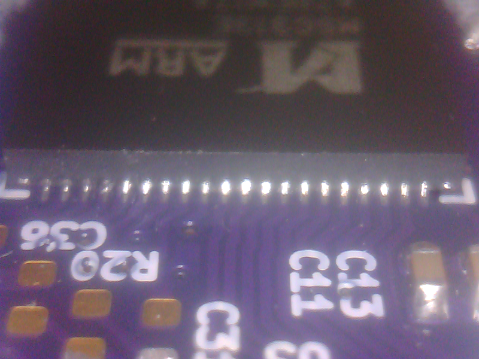
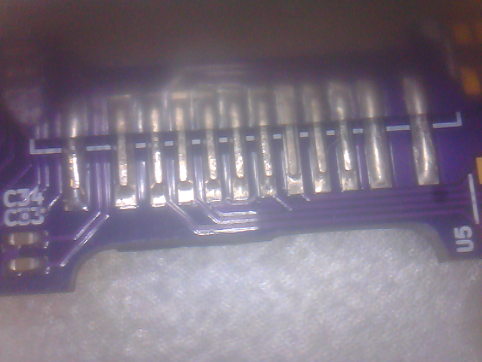
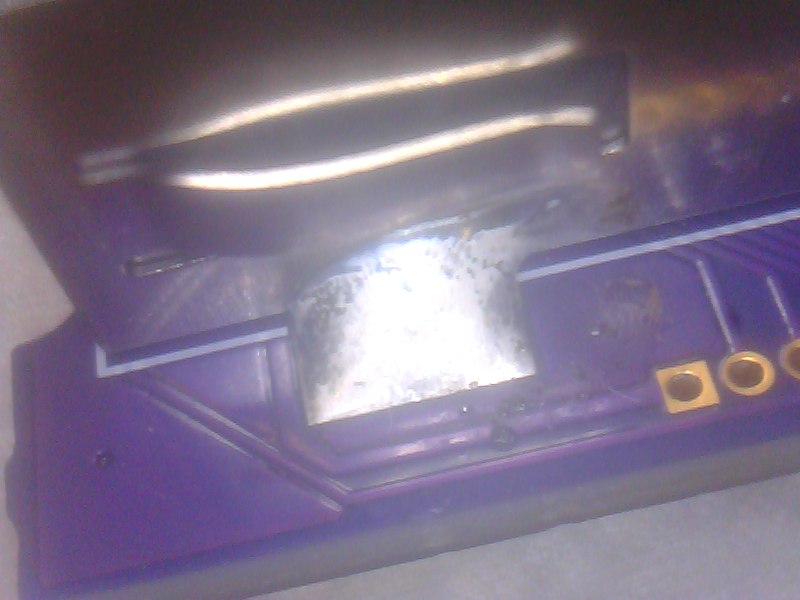

** this isn't finished yet **

# How to build a breadbee

These are some rough instructions base on how I've been hand assembling boards. If you have a reflow oven or a pick and place machine you can probably do better on your own..

## What you need

- The parts
- A hot air rework tool. Cheapies work just fine.
- Tweezers, poking implements.
- Side cutters.
- Kapton tape.
- Sharp small craft knife blade with tape wrapped around it so that it looks like some sort of prison weapon.
- Solder paste. Low temp stuff is the easiest to work with but can result in brittle joints for the usb connector. If you use low temp solder you probably want some epoxy to reinforce the usb connector.
- Solder wick.
- A soldering iron with a knife or if you can't get a knife tip a small point. A small point isn't ideal but you won't have space to get a massive chisel tip into the places you need.
- Flux in with bottle a little brush applicator or gel style SMD rework flux. Flux pens aren't ideal.
- Proper flux cleaner or at least IPA.
- Old tooth brush.
- USB camera or lupe.
- Time
- Patience

## Technique

Generally building a board in stages isn't good. Constantly reheating the board means that all of the components are going through multiple heating cycles and can lead to other components wondering off and the board getting thrown out of the window. However, realisticly you aren't going to be able to put doing the QFNs and all of the passives in one go.

Building in with the steps below should result in usable boards. Maybe not production quality super high quality ones but ones that will work for your projects.

## 0 - Tape the board down

If you have a nice PCB vice then use that. Otherwise tape the board down to your work surface with kapton tape. If you think you will need to rotate the board while soldering find something with some weight you can tape it to that won't melt or suck all of the heat out of the board while soldering. I use a square of MDF covered in kapton tape.

You must tape it down as the board is very small and you will not be able to overcome the surface tension of the components to reposition them if you don't. Instead you'll be desperately trying to poke a component into place and the little board will be moving around instead. Also if you're like me and knudge stuff by mistake you'll be happy the board was taped down and not on the floor with all of the components smeared across it.

## 1 - Mount the MSC313E

This may seem counter intuitive, mounting the most expensive and hardest to get part first, but it becomes really hard to work with the MSC313E once the surrounding components are mounted. If you manage to destroy the board while mounting other components later you can always pull it off and use it on the next one.

The high pin count might be a bit intimidating but actually it's one of the easiest parts of the build. Basically you just need to smear a thin square layer of solder paste that covers both the small outter pads and the big center pad. You don't have to be super precise here. You don't want to have too much excess but having too little paste is worse than too much.

Once you have a nice square patch of solder paste drop the MSC313E onto it making sure the pin 1 dot lines up with the indicator on the silk screen. If you don't get it aligned now don't bother repositioning it. You don't really need to and you'll just get paste everywhere. As long as it's generally inside of the border silk screen you're ok.

Now with your hot air tool waft hot air around the whole board. You should see that the solder paste that is still visible liquidifies slightly and starts to look a bit like a t-1000 is going to form out of it. Once this happens you should stop wafting the hot air everywhere and focus it over the MSC313E. If you have a nozzle that covers the whole area just holding it above should be good enough. If you have a smaller nozzle move in a circular motion over the chip to make sure everything is heated up. You should now see the chip ping into place and sit right in the middle of the silk screen boarder and round blobs of excess solder forming around the edges. You should use your tweezers or other pokey thing now to tap it a bit to push out the rest of the excess solder and confirm that it's located itself. If you poke it up a little bit you should see it instantly move back where it was. If the chip seems slightly rotated or offset that means it's located itself one or two pads off. You should be able to poke it in the opposite direction and see it click into the right place. You need to poke while keeping the solder molten. Once you're happy it's in the right place back off with the hot air and take a little break. Don't worry about all of the solder balls around the edge for now. Also don't worry if some solder escaped and got onto surrounding pads.

Once you have your breath back get you solder wick and cut the end into triangle with a wide edge and sharp point. Start wafting hot air at the edge of the MSC313E you're going to clean up first and wait until the solder is molten again. Once the solder is molten again brush the edge of the chip with your solder wick edge while tracking with the hot air. You should see all of the balls of excess solder disappear and leave you with a nice clean edge. You probably won't be able to see how nice it looks right now because of all of the flux from the paste but you should have no bridges and clean connections to the chip. The key here is to be gentle. The wick will move the chip if you aren't careful. You only really want to pass the wick through the balls of excess solder to mop them up not really have it come in contact with the chip itself.

Now that the excess solder is gone you can take another little break and wait for everything to cool down again. Once it looks like everything solid again take some of your flux remover and cover the area around the MSC313E. Take your old tooth brush and scrub away the flux. If you have good eyes you should be able to see if there are any bridges, blobly bits, dry pads etc. Once you've done the solder wick trick a few times you should always end up with something that's pretty much perfect. Anyhow if you do have bridges or blobs you just need to apply some flux and then drag your soldering iron along the edge to neaten everything up. You want to do this before mounting any more components as you won't have the space later.

# Mount the EA3036C

Use exactly the same process as the MSC313E.

# Mount the inductors

# Mount a lot of the 1uf caps

Start from C11 and go counter clockwise up to C37, dab paste and place the caps and then reflow them

# Mount the R23, and some more 1uf caps

# Mount the crystal and support components

# Mount more 1uf caps

# Mount the two 10uF caps and resistors

# mount c23 and r?

# mount the big row of passives above the EA3036C

# Mount the left side of the block of passives to the left of the EA3036

# Mount the right side of the block of passives to the left of the EA3036

# mount the CH341e

# mount the USB connector

# mount the leds

# First test

# Mount the two jumpers

# mount the two caps

# Mount the Ethernet jack

# mount the spi nor

You can mount the SPI NOR with out anything on it as long as you have a programming clip. You need to write it first.

# flash the spi nor

# Profit?

## Smoke test

If possible plug the board into a bench power supply with the current limit set at ~200mA.
If the board is generally working you should see current draw of ~10mA for a short time and then between 80mA and 100mA.

If the current draw stays at around ~10mA the processor is probably running but the initial boot stage isn't getting loaded
from NOR flash. If the current draw is ~0mA then you probably have a power supply issue.

If you don't have a bench power supply one of those cheap USB power meters works as well but without the protection
of being able to limit the current if you have something really wrong. You should probably try with a USB charger and
not the USB port of your expensive computer initially.

Generally speaking nothing should be getting hot once you plug it in. If board is getting hot when you power it up kill the
power and check for shorts etc.

## Fingers crossed..

If the magic smoke didn't come out you should be good to plug it into your computer now.

A few moments after plugging it in you should see the usb->serial chip get registered. If you see no USB activity or your OS
is complaining that it couldn't enumerate the device you might need to check the USB connector soldering.

The current u-boot will turn on the D2 led (top left corner) when it starts so you can see the processor has gotten that far
so you might be able to see that your board is running even if the usb->serial part isn't coming up.

# Power supply debugging

## Check the input power is getting from the USB connector to the board:

- Check there is 5v on pin 1 of J2

If this is missing check your USB connector soldering.

## Check the outputs from the EA3036C are right:

- Check there is ~1v on C28
- Check there is ~3.3v on pin 1 of J4
- Check there is ~1.8v on C23

If any of these rails are missing or the wrong voltages you'll need to check over the power supply area.
Missing voltages might be soldering issues. Wrong voltages might be component value mistakes.

## Check that internal LDO of the SoC is alive

- Check there is ~0.9v on C38

If this isn't present check around the SoC to see if there are any obvious bad joints.

# Boot/NOR debugging

